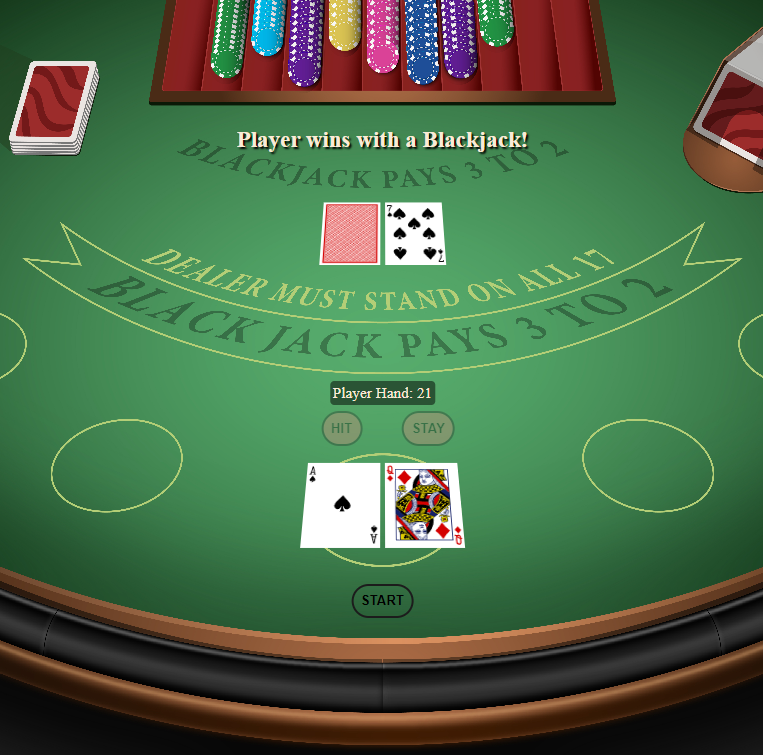

# Blackjack Game

Play it live [here](https://enes-blackjack.netlify.app/).

## Overview

This is a basic implementation of the Blackjack card game, also known as 21.

In this game, you'll go head-to-head with an automated dealer, trying to draw cards that total as close to 21 as possible without going over.

## How to Play

1. Click the **Deal New Hands** button to get your starting cards.
2. You have the option to **HIT** to draw another card or **STAY** to stick with your current hand.
3. The goal is to have a hand total as close to 21 as possible without exceeding it. Going over is a bust, and you lose automatically.
4. The dealer reveals their hidden card after you decide to stay. They will draw until their hand totals 17 or more.
5. If your hand is closer to 21 than the dealer's without busting, you win!

## Game Rules

- Cards from 2 to 10 are worth their face value.
- Kings, Queens, and Jacks are worth 10 points.
- Aces can be either 1 or 11 points.
- If the total of your hand exceeds 21, you bust and lose immediately.
- If you and the dealer tie, it's a push, and no one wins.

## Features

- Responsive design suitable for both mobile and desktop.
- Disabled **HIT** and **STAY** buttons during non-playable moments to guide the player.

## Future Enhancements

- Add betting functionality.
- Introduce the ability to split hands.
- Implement multiplayer mode.
